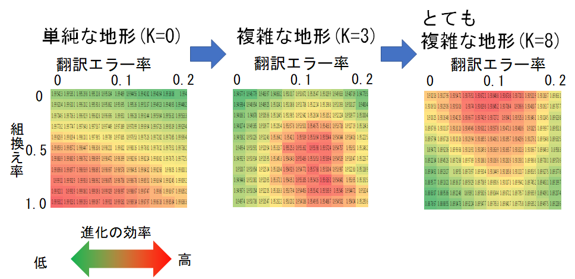

# GA-using-an-evaluation-function-called-NK-landscape
2020年度の早稲田大学先進理工学電気情報生命工学科木賀研究室で行った卒業研究で使用したコードです。親の遺伝子を子孫に伝える上での組換え率とタンパク質を合成する翻訳の過程で生じるエラー率が
生物の進化にどのような影響を与えるのかをC++を使ってシミュレーションしたコードです。以下の図がタンパク質の適応度地形の複雑さごとの組換え率と翻訳エラー率のヒートマップグラフです。赤ほど、機能が高い生体に速く進化できることを示します。一方、緑ほど進化が遅いということを示します。このコードによって算出したデータから翻訳エラー率と組換え率の組み合わせで規定される進化の最適値が、地形の複雑さに依存することがわかりました。 

